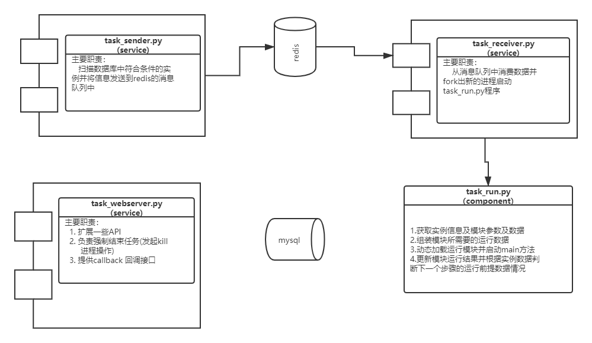
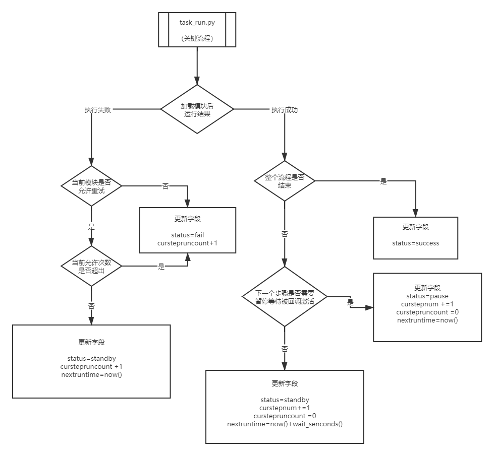

# Smart Task Flow

工具定位：

1. 一个可以敏捷定制化的流程任务工具
2. 用户只需要关注自己需要实现的模块
3. 支持流程中的任务进行重试，延迟执行，callback回调，任务跳过，任务终止
4. 具有任务执行分布式处理提高任务处理容量
5. 添加新模块不需要重启即可生效
6. 源代码极简模式，前端与后端分开管理没有依赖 (前端甚至可以没有)

工具解决问题：

​	在日常运维中，经常会有这样的需求，制作一个通用的流程完成将人工操作改造成自动化流程步骤。

举个例子：

有一家互联网公司，需要上线一批服务器，为了完成自动化上线的功能，需要以下几个步骤：
1. CMS信息更新
2. 安装系统
3. 格式化数据盘
4. 配置系统环境
5. 安装应用环境
6. 服务器上线

以上6步骤,可以轻松按照模块来进行定义输入参数并实现代码

模块接入：

​	为了敏捷和通用性，可以根据自己的需求快速的定制自己的模块,
模块的规范特别简单,
只需要在modules 文件夹中创建自己的模块脚本。

模块规范：

1. 必须有main(**kwargs)入口函数
2. main函数返回值

	> 情况一：bool类型

	> 情况二：tuple类型 bool,message 

	> 情况三：没有返回

主要的服务说明:

1. 待运行实例扫描服务(task_sender.py)   

2. 任务发送服务(task_receiver.py)   

3. 扩展接口服务(task_webserver.py)

运行流程图：

运行模块的关键程序instance表数据更新逻辑:

